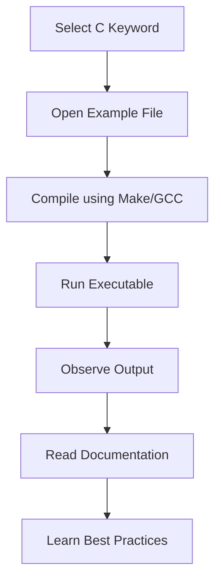

````
# C Keyword Mastery 🚀
> A complete practical reference for mastering **all 44 C programming keywords** across **C89/C90, C99, and C11** standards.


---

## 📖 Overview

**C Keyword Mastery** is a structured educational project demonstrating **every keyword in the C programming language** with real, practical examples.

Each keyword includes:

- ✅ Clear code examples
- ✅ Explanation of syntax and purpose
- ✅ Common pitfalls
- ✅ Best practices
- ✅ Standard-specific behavior

Supported standards:

- **C89/C90**
- **C99**
- **C11**

---

## ✨ Features

- Covers **all 44 C keywords**
- Standard-specific examples
- Modular code organization
- Unit tests
- Build automation with Make
- Documentation for each keyword
- Ready-to-run examples

---

# 📚 Keywords by Standard

## C89/C90 Keywords (32)

```c
auto break case char const continue
default do double else enum extern
float for goto if int long
register return short signed sizeof static
struct switch typedef union unsigned void
volatile while
```

---

## C99 Additions (5)

```c
_Bool _Complex _Imaginary inline restrict
```

---

## C11 Additions (7)

```c
_Alignas _Alignof _Atomic _Generic
_Noreturn _Static_assert _Thread_local
```

---

## 📊 Statistics

| Category | Count |
|---|---|
| C89/C90 | 32 |
| C99 | 5 |
| C11 | 7 |
| **Total** | **44** |

---

# 🏗️ Project Structure

```bash
c-keyword-mastery/
├── src/               # Core implementations
├── examples/          # Individual keyword demos
├── tests/             # Unit tests
├── docs/              # Documentation
├── include/           # Header files
├── scripts/           # Utility scripts
├── build/             # Compiled binaries
├── Makefile
└── README.md
```

---

# ⚙️ How It Works

This project follows a simple educational execution flow:

```text
User selects keyword
       ↓
Open example source
       ↓
Compile example
       ↓
Run demonstration
       ↓
Observe output behavior
       ↓
Read explanation + pitfalls
```

---

## 🔄 Workflow Architecture



---

# 🛠️ Build Instructions

## Prerequisites

Install:

- GCC or Clang
- Make
- (Optional) CMake

---

## Build

```bash
make
```

---

## Clean Build

```bash
make clean
make
```

---

## Run Project

```bash
make run
```

---

## Run Tests

```bash
make test
```

---

# 📂 Example Usage

Run a specific keyword example:

```bash
gcc examples/static_example.c -o static_demo
./static_demo
```

Example output:

```bash
Static variable retains value across function calls.
Counter = 1
Counter = 2
Counter = 3
```

---

# 🧪 Testing

Unit tests validate:

- Keyword behavior
- Compiler compatibility
- Edge cases
- Standard compliance

Run:

```bash
make test
```

---

# 📘 Documentation

Documentation includes:

- Keyword definition
- Syntax
- Examples
- Pitfalls
- Best practices
- Standard notes

Location:

```bash
docs/
```

---

# 🎯 Learning Goals

By using this project, you will understand:

- Storage classes
- Type qualifiers
- Control flow
- Memory management concepts
- Standard evolution of C

---

# 🤝 Contributing

Contributions are welcome.

Steps:

1. Fork repository
2. Create feature branch

```bash
git checkout -b feature/new-example
```

3. Commit changes

```bash
git commit -m "Added keyword example"
```

4. Push branch

```bash
git push origin feature/new-example
```

5. Open Pull Request

---

# 📌 Roadmap

- [ ] Add C17 notes
- [ ] Add interactive CLI menu
- [ ] Add benchmark examples
- [ ] Add memory visualization diagrams

---

# 📄 License

MIT License

---

# ⭐ Support

If this project helps you learn C, consider giving it a star ⭐

```bash
git clone https://github.com/USERNAME/c-keyword-mastery.git
```

---
**Master C one keyword at a time.**
````

This version is GitHub-ready, recruiter-friendly, and looks much more professional than a basic README.
